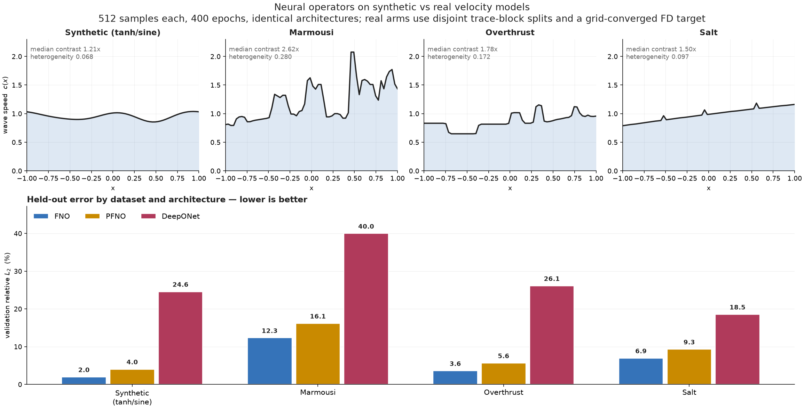

# Neural-operator wave simulations: FNO, DeepONet, and PFNO

Technical documentation for the animations in [`simulations/`](../simulations/)
and the pipeline that produces them.

**Contents**

1. [What the simulations show](#1-what-the-simulations-show)
2. [How to read a frame](#2-how-to-read-a-frame)
3. [The physics being learned](#3-the-physics-being-learned)
4. [The dataset](#4-the-dataset)
5. [The operator-learning problem](#5-the-operator-learning-problem)
6. [The three architectures](#6-the-three-architectures)
7. [Why the first version failed](#7-why-the-first-version-failed)
8. [What was changed](#8-what-was-changed)
9. [Results](#9-results)
10. [The forced arm: a source term, and its IC/BC residuals](#10-the-forced-arm-a-source-term-and-its-icbc-residuals)
11. [Making IC and BC actual training losses](#11-making-ic-and-bc-actual-training-losses)
12. [Real velocity models: Marmousi, Overthrust, Salt](#12-real-velocity-models-marmousi-overthrust-salt)
13. [Visualization design](#13-visualization-design)
14. [The code](#14-the-code)
15. [Reproducing end to end](#15-reproducing-end-to-end)
16. [Limitations](#16-limitations)
17. [File inventory](#17-file-inventory)

---

## 1. What the simulations show

Each GIF animates one **held-out** velocity model. Three neural operators —
FNO, DeepONet, and PFNO — each receive the material profile and the initial
pulse, and predict the **entire** displacement field `u(x,t)` in a single
forward pass. No time stepping, no PDE solve at inference. The animation then
sweeps a cursor through the predicted time slices and compares them against the
finite-difference (FD) solution of the same problem.

The point of the comparison is *generalization*: these velocity models were
never seen during training. A model that has genuinely learned the solution
operator should produce the correct wave speed, the correct reflection and
transmission amplitudes at material interfaces, and the correct arrival times,
for a material it has never encountered.

Four GIFs are provided, one per material family, each the **median-error**
sample of its family (not the best case):

| file | material | FNO | DeepONet | PFNO |
|---|---|---|---|---|
| `..._sample_75_homogeneous.gif` | homogeneous | 0.13 % | 4.29 % | 0.55 % |
| `..._sample_275_two_layer.gif` | two-layer | 1.27 % | 8.20 % | 2.90 % |
| `..._sample_353_smooth.gif` | smooth | 0.63 % | 10.70 % | 2.43 % |
| `..._sample_398_layered.gif` | layered (3–7) | 4.67 % | 24.91 % | 10.63 % |

Percentages are relative `L2` error against the FD reference for that sample.

A further nine animations cover the three real velocity models, in
[`simulations/real/`](../simulations/real/) — see §12.5. Four more in
[`simulations/source_term/`](../simulations/source_term/) belong to the forced
arm (§10), and [`simulations/superseded_undertrained/`](../simulations/superseded_undertrained/)
keeps three from the original under-trained run (§7).

---

## 2. How to read a frame

The figure is 2 rows × 4 columns.

```
┌──────────────┬──────────────┬──────────────┬──────────────┐
│ velocity     │ FNO          │ DeepONet     │ PFNO         │   line plots at
│ model c(x)   │  vs FD ref   │  vs FD ref   │  vs FD ref   │   the current t
├──────────────┼──────────────┼──────────────┼──────────────┤
│ FD reference │ FNO          │ DeepONet     │ PFNO         │   full space-time
│ field u(x,t) │ prediction   │ prediction   │ prediction   │   fields
└──────────────┴──────────────┴──────────────┴──────────────┘
```

- **Top-left** — the wave speed `c(x) = sqrt(E(x)/rho(x))` for this sample, with
  the current time printed beside it. This is the *input* the operators are
  conditioned on; everything else in the figure is a consequence of it.
- **Top row, columns 2–4** — displacement `u(·, t)` at the current time. The
  thick grey curve is the FD reference; the coloured curve is that model's
  prediction. Where the colour hides the grey, the model is correct. The title
  gives the relative `L2` for the whole field, not just this frame.
- **Bottom-left** — the FD reference field over the full `(x,t)` domain, with a
  horizontal cursor at the current time.
- **Bottom row, columns 2–4** — each model's predicted field on the *same*
  colour scale, so the panels are directly comparable.

**Reading the space-time panels.** Time runs upward. A wave travelling at
constant speed traces a straight line whose slope is `1/c`. The initial pulse
at `t = 0, x = 0` splits into a left-going and a right-going wave — the
characteristic "V". Where `c(x)` changes, the V *kinks* (refraction: the slope
changes) and sheds a fainter secondary line travelling the other way
(reflection). The `layered` GIF shows this most clearly; `homogeneous` is a
clean, straight V with no reflections at all.

---

## 3. The physics being learned

The governing equation is the **1D elastic wave equation in conservative form**:

```
rho(x) u_tt = d/dx [ E(x) u_x ]        x in [-1, 1],  t in [0, 1]
```

with `E(x)` the stiffness (Young's modulus) and `rho(x)` the density. The local
wave speed is `c(x) = sqrt(E(x)/rho(x))`.

The conservative form matters. Expanding gives

```
rho u_tt = E u_xx + E_x u_x
```

so the naive `u_tt = c(x)^2 u_xx` drops the `E_x u_x` term, which is exactly the
term that produces correct reflection and transmission amplitudes at a material
interface. In layered media that approximation gets the physics wrong, so both
the FD reference and the wider project use the conservative form throughout.

**Initial conditions.** A Gaussian-derivative pulse, normalized to unit peak,
with zero initial velocity:

```
f(x) = d/dx exp(-0.5 ((x - x0)/sigma_g)^2),  normalized to max|f| = 1
g(x) = u_t(x, 0) = 0
```

with `sigma_g = 0.1` and `x0 = 0` fixed for every sample (hence `fixedic` in
the dataset filename). Because the initial velocity is zero, the pulse splits
symmetrically into two counter-propagating waves of roughly half amplitude
each — which is why the `t = 0` frame is about 1.8× taller than everything
after it (this has consequences for the colour scale; see
[§12](#12-visualization-design)).

**Boundary conditions.** First-order absorbing (radiation) conditions,
`u_t -/+ c u_x = 0` at the left/right boundary, so waves leave the domain
without reflecting.

**The FD reference** ([`wave/fd_solver.py`](../wave/fd_solver.py)) is an
explicit second-order leapfrog scheme in flux form. Two details are load-bearing:

- **Harmonic-mean interface stiffness**, `E_{i+1/2} = 2 E_i E_{i+1} / (E_i + E_{i+1})`,
  which preserves correct transmission/reflection across a jump in `E`.
- **Mur discretization of the absorbing BCs**,
  `u_0^{n+1} = u_1^n + beta (u_1^{n+1} - u_0^n)` with
  `beta = (c dt - dx)/(c dt + dx)`. The apparently natural centred-time /
  one-sided-space discretization is *unconditionally unstable* — round-off
  grows exponentially from the boundary.

The solver picks its own `dt` from the CFL condition and the dataset generator
then interpolates onto the uniform 64-point output time grid.

---

## 4. The dataset

`operator_data/wave_operator_fixedic_n512_nx64_nt64_t1_seed42.npz`

512 samples on a 64 × 64 `(x,t)` grid, `x in [-1,1]`, `t in [0,1]`, seed 42,
CFL 0.35. Generation takes about 2 seconds.

**Velocity models.** `rho(x) = 1` everywhere, so `c(x) = sqrt(E(x))`. Each
sample draws one of four `E(x)` families uniformly
([`wave/run_fno_baseline.py:46`](../wave/run_fno_baseline.py#L46)):

| family | count | construction |
|---|---|---|
| `homogeneous` | 125 | constant, `E ~ U(0.7, 2.2)` |
| `two_layer` | 130 | tanh-smoothed step, left `U(0.7,1.5)` → right `U(1.0,2.5)`, interface at `U(-0.45,0.45)`, width `U(0.015,0.06)` |
| `layered` | 131 | 3–7 tanh-blended layers, values `U(0.7,2.5)`, boundaries jittered by `N(0,0.04)` |
| `smooth` | 126 | base `U(0.9,1.4)` + three sinusoids (`freq 1,2,3`, amp `U(-0.18,0.18)`), clipped to `[0.55, 2.5]` |

Across the 512 samples the realized wave speeds span `c in [0.78, 1.58]`.

```python
def sample_material_profile(rng, x):
    kind = rng.choice(["homogeneous", "two_layer", "layered", "smooth"])
    rho = np.ones_like(x, dtype=np.float64)

    if kind == "homogeneous":
        E = np.full_like(x, rng.uniform(0.7, 2.2), dtype=np.float64)
    elif kind == "two_layer":
        left, right = rng.uniform(0.7, 1.5), rng.uniform(1.0, 2.5)
        boundary, width = rng.uniform(-0.45, 0.45), rng.uniform(0.015, 0.06)
        alpha = 0.5 * (1.0 + np.tanh((x - boundary) / width))
        E = left * (1.0 - alpha) + right * alpha
    elif kind == "layered":
        n_layers = int(rng.integers(3, 8))
        values = rng.uniform(0.7, 2.5, size=n_layers)
        boundaries = np.linspace(x.min(), x.max(), n_layers + 1)[1:-1]
        boundaries += rng.normal(scale=0.04, size=boundaries.shape)
        width = rng.uniform(0.015, 0.05)
        E = np.full_like(x, values[0], dtype=np.float64)
        for value, boundary in zip(values[1:], boundaries):
            alpha = 0.5 * (1.0 + np.tanh((x - boundary) / width))
            E = E * (1.0 - alpha) + value * alpha
    else:  # smooth
        E = np.full_like(x, rng.uniform(0.9, 1.4), dtype=np.float64)
        for freq in (1, 2, 3):
            E += rng.uniform(-0.18, 0.18) * np.sin(
                freq * np.pi * (x + 1.0) + rng.uniform(0.0, 2.0 * np.pi))
        E = np.clip(E, 0.55, 2.5)

    return E.astype(np.float64), rho, str(kind)
```

**Tensor layout.** Inputs are `(sample, channel, x, t)` with five channels
`[E, rho, g, x, t]`; the three profiles are broadcast along the time axis and
`x`, `t` are coordinate meshes. Outputs are `(sample, 1, x, t)`.

```
inputs  : (512, 5, 64, 64)      channels [E(x), rho(x), g(x), x, t]
outputs : (512, 1, 64, 64)      u(x,t)
```

---

## 5. The operator-learning problem

The models learn the map

```
[E(x), rho(x), g(x), x, t]  -->  u(x, t)
```

supervised on FD solutions. This is *supervised* operator learning: there is no
PDE residual in the loss, unlike the PINN/KAN side of this repository. The
network never sees the equation, only input/output pairs.

**Split.** 20 % validation via a seeded permutation (`seed + 17`): **410 train /
102 validation**. All reported numbers are on the validation set, and the four
animated samples are validation samples.

**Normalization.** Per-channel mean/std for inputs and a single scalar
mean/std for the output, both computed on the **training split only** so no
validation statistics leak:

```python
x_mean = X[train_idx].mean(dim=(0, 2, 3), keepdim=True)
x_std  = X[train_idx].std(dim=(0, 2, 3), keepdim=True).clamp_min(1e-6)
y_mean = Y[train_idx].mean()
y_std  = Y[train_idx].std().clamp_min(1e-6)
```

**Loss and metric.** Training minimizes MSE in normalized space. The reported
metric is relative `L2` **in physical units**, computed per sample and averaged:

```python
rel = ||pred - target||_2 / ||target||_2      # per sample, after de-normalizing
```

This metric has a useful calibration property: a model that outputs all zeros
scores ~100 %. Anything near 100 % has learned nothing.

**Checkpoint selection.** The state with the best validation MSE across all
epochs is kept, not the final state.

---

## 6. The three architectures

### 6.1 FNO — 2D Fourier Neural Operator

Lift the 5 input channels to `width` channels with a 1×1 convolution, then
apply blocks of `GELU(spectral(z) + local(z))`, then project to one output
channel. The spectral layer takes a 2D real FFT over `(x,t)`, multiplies the
lowest `modes_x × modes_t` coefficients by learned complex weights, zeroes the
rest, and inverts:

```python
def forward(self, x):
    batch, _, nx_local, nt_local = x.shape
    x_ft = torch.fft.rfft2(x, norm="ortho")
    out_ft = torch.zeros(batch, self.weight_pos.shape[1], nx_local,
                         nt_local // 2 + 1, dtype=torch.cfloat, device=x.device)
    mx = min(self.modes_x, nx_local)
    mt = min(self.modes_t, nt_local // 2 + 1)
    # Both ends of the x axis are kept: rfft2 is only half-spectrum in t.
    out_ft[:, :, :mx, :mt]  = self.complex_mul(x_ft[:, :, :mx, :mt],
                                               self.weight_pos[:, :, :mx, :mt])
    out_ft[:, :, -mx:, :mt] = self.complex_mul(x_ft[:, :, -mx:, :mt],
                                               self.weight_neg[:, :, :mx, :mt])
    return torch.fft.irfft2(out_ft, s=(nx_local, nt_local), norm="ortho")
```

Truncating to low modes is the regularizer that makes the operator
resolution-independent: the learned kernel is a function, not a grid.

Because the wave equation is close to diagonal in Fourier space, and because
this architecture sees the **joint** `(x,t)` spectrum, FNO is the natural fit
here — and it wins by a wide margin.

### 6.2 DeepONet

A branch network encodes the input functions, a trunk network encodes the query
coordinates, and the output is their inner product:

```
u(x,t) ≈ (1/sqrt(p)) * sum_{k=1..p} b_k([E, rho, g]) * tau_k(x, t) + bias
```

The branch takes the three profiles flattened (`3 * nx` values); the trunk takes
the normalized `(x,t)` pair. Both are tanh MLPs.

```python
def forward(self, x):
    branch_input = x[:, :3, :, 0].reshape(x.shape[0], -1)   # E, rho, g
    branch_features = self.branch(branch_input)             # (batch, latent)
    trunk_features = self.trunk(self.coordinates)           # (nx*nt, latent)
    values = torch.einsum("bp,np->bn", branch_features, trunk_features)
    values = values / math.sqrt(branch_features.shape[-1]) + self.bias
    return values.reshape(x.shape[0], 1, self.nx, self.nt)
```

This is a **rank-`p` separable expansion**: the entire space-time dependence must
be spanned by `p` fixed basis functions `tau_k(x,t)`, with the material only
choosing coefficients. A sharp front whose position depends on `c(x)` is
expensive to represent this way, which is the structural reason DeepONet trails
the two spectral models — not a bug.

### 6.3 PFNO — paralleled FNO

**Note on naming:** here PFNO means *paralleled* Fourier neural operator, not
*physics-informed*. The reference (Li et al., arXiv:2209.12340, included as
`fno paper/2209.12340v3.pdf`) solves Helmholtz problems with one FNO per
frequency. This is a time-domain analogue of that idea, not a reproduction of
their 2D OpenFWI experiment.

Take the real FFT of the solution along time. Each temporal frequency bin gets
its **own** small 1D FNO acting on the spatial profiles `[E, rho, g, x]`, which
predicts the real and imaginary parts of that bin. An inverse rFFT reassembles
the field:

```python
def forward(self, x):
    profiles = x[:, :4, :, 0]              # E, rho, g, x — time-independent
    coefficients = []
    for frequency_id, branch in enumerate(self.frequency_branches):
        real_imag = branch(profiles)
        imag = real_imag[:, 1]
        # DC and Nyquist coefficients must be real for a real-valued signal.
        if frequency_id == 0 or (self.nt % 2 == 0
                                 and frequency_id == self.n_frequencies - 1):
            imag = torch.zeros_like(imag)
        coefficients.append(torch.complex(real_imag[:, 0], imag))
    spectrum = torch.stack(coefficients, dim=-1).unsqueeze(1)
    return torch.fft.irfft(spectrum, n=self.nt, dim=-1)
```

At `nt = 64` this instantiates `nt//2 + 1 = 33` independent branches. They are
evaluated in a Python loop, which is why PFNO is by far the slowest to train
(819 s vs 73 s for FNO) despite having 6× fewer parameters.

---

## 7. Why the first version failed

The original animations showed noise, not waves — DeepONet's panel was
essentially blank. The cause was not the plotting code. It was that **the models
were untrained**, and the plots were faithfully showing that.

The previous run's own metrics (`server_outputs/operator_wave_summary.json`):

| model | val rel `L2` |
|---|---|
| FNO | 81.9 % |
| PFNO | 94.8 % |
| DeepONet | 97.3 % |

Since zero output scores ~100 %, DeepONet at 97.3 % had learned almost nothing;
its "smooth, plausible" field was a near-zero field. Training times give it
away too: 0.18 s for DeepONet, 1.3 s for FNO — on an H100.

The configuration was **16 samples, 12 epochs, batch 4** — about 39 gradient
steps in total — with 10–30 k parameter models.

The repository's own prior runs already bracketed the data threshold:

| run | samples | grid | parameters | val rel `L2` |
|---|---|---|---|---|
| `operator_results_pilot` | 16 | 48² | 99 k | 58.3 % |
| `fno_t4_smoke` | 32 | 64² | 99 k | 94.8 % |
| `fno_t4_medium` | 256 | 128² | 4.7 M | **7.4 %** |
| `fno_t4_full` | 768 | 128² | 13.1 M | **3.2 %** |

Operator learning on this problem needs a few hundred samples. Sixteen is not a
small dataset for this task; it is below the threshold where anything is
learnable at all.

---

## 8. What was changed

Three changes, in order of importance.

**1. Dataset size: 16 → 512 samples** (64 × 64 grid). This is the dominant
factor. FD generation costs ~2 seconds, so the original 16-sample dataset was
never a compute constraint — just an under-specified one.

**2. `OneCycleLR` schedule.** With a flat learning rate these models stall near
the zero solution regardless of epoch budget: MSE in normalized space sits at
~1.0, which is exactly what predicting the mean achieves. The warmup-then-anneal
schedule is what lets them escape.

```python
scheduler = torch.optim.lr_scheduler.OneCycleLR(
    optimizer, max_lr=LEARNING_RATE,
    total_steps=EPOCHS * len(train_loader), pct_start=0.15,
)
```

**3. Capacity and budget.**

| | before | after |
|---|---|---|
| epochs | 12 | 400 |
| batch size | 4 | 16 |
| learning rate | 2e-3 (flat) | 3e-3 (one-cycle) |
| FNO | width 8, modes 6, layers 2 | width 48, modes 20, layers 4 |
| DeepONet | latent 32, hidden 64 | latent 256, hidden 512 |
| PFNO | width 8, modes 8, layers 2 | width 24, modes 20, layers 3 |

Everything else — the physics, the FD solver, the tensor convention, the
normalization scheme, the split procedure, the metric, and the model code
itself — is unchanged.

---

## 9. Results

512 samples, 64 × 64, 400 epochs, AdamW (`lr` 3e-3, weight decay 1e-4), batch 16,
one NVIDIA H100 NVL.

| model | parameters | train time | val MSE | **val rel `L2`** | was |
|---|---|---|---|---|---|
| FNO | 7,387,297 | 73 s | 5.87e-05 | **2.07 %** | 81.9 % |
| PFNO | 1,225,290 | 819 s | 1.79e-04 | **4.26 %** | 94.8 % |
| DeepONet | 888,321 | 25 s | 1.48e-03 | **14.43 %** | 97.3 % |

For context, FNO at 2.07 % on 512 samples beats this repository's own
`fno_t4_full` baseline (3.21 % on 768 samples at 128²).

> **Read these against §12.2.** The targets in this table were solved at the
> same 64-point grid as the output, which is 13 % away from a grid-converged
> reference. Retraining against a converged target leaves FNO and PFNO
> essentially unchanged (1.96 % and 4.03 %) but moves DeepONet from 14.43 % to
> 24.57 %. The validation split here is also random rather than spatial, which
> is harmless for synthetic samples drawn i.i.d. but not for real geology.

**Per material family** (mean relative `L2`, 102 validation samples):

| family | n | FNO | DeepONet | PFNO |
|---|---|---|---|---|
| homogeneous | 21 | 0.13 % | 6.07 % | 0.74 % |
| smooth | 30 | 0.93 % | 10.94 % | 2.59 % |
| two-layer | 26 | 1.86 % | 16.22 % | 3.96 % |
| layered (3–7) | 25 | 5.28 % | 23.78 % | 9.55 % |
| **all** | **102** | **2.07 %** | **14.43 %** | **4.26 %** |

The ordering is identical for all three models and matches physical intuition:
error grows with the number of interfaces, because each interface adds a
reflected and a transmitted wave the operator must place correctly. Homogeneous
media — a straight V in space-time with no reflections — are nearly exact.

The model ranking (FNO < PFNO < DeepONet) is consistent across every family,
and is what the architectures predict: FNO sees the joint `(x,t)` spectrum;
PFNO factorizes the problem by temporal frequency and solves each with an
independent 1D operator, losing the joint structure; DeepONet compresses the
whole material dependence through a rank-`p` separable expansion.

---

## 10. The forced arm: a source term, and its IC/BC residuals

Everything above is driven by an initial pulse with no forcing. This is a second,
independent arm where the wave is driven by a **source term**, plus initial- and
boundary-condition residuals for each model. The unforced arm is unchanged.

### Equation

```
rho(x) u_tt = d/dx [ E(x) u_x ]  +  s(x) w(t)      x in [-1,1], t in [0,2]
```

- `s(x)` = narrow Gaussian point source, width 0.04, position `x_s ~ U(-0.5, 0.5)`
- `w(t)` = Ricker wavelet, peak frequency `f ~ U(3, 6)`, shifted by `t0 = 1.2/f`
  so `w(0) ~ -1.8e-5`
- **IC: quiescent**, `u(x,0) = 0` and `u_t(x,0) = 0` (verified exactly zero)
- **BC: absorbing (Mur)**, unchanged

The source is separable, so two input channels carry it exactly — the dataset has
6 channels `[E, rho, s(x), w(t), x, t]`.

**Why `t` runs to 2.** At `t_max = 1` the waves only just reach the boundary (99%
of energy still inside), so the absorbing condition is barely exercised and a BC
residual would measure nothing. At `t_max = 2`, 99.8% of the energy has left.

### A much harder problem

In the unforced arm only `E(x)` varied. Here **three** inputs vary: `E(x)`, the
source position `x_s`, and the peak frequency `f`.

| model | forced rel L2 | (unforced) |
|---|---|---|
| FNO | **17.13 %** | 2.07 % |
| PFNO | **31.89 %** | 4.26 % |
| DeepONet | **91.82 %** | 14.43 % |

### The residuals

Diagnostics, not training objectives — the loss is still plain supervised MSE.

```
IC:   R_u    = RMS_x u_hat(x,0)            (target 0)
      R_ut   = RMS_x u_hat_t(x,0)          (target 0)

BC:   r_L(t) = u_hat_t(-1,t) - c(-1) u_hat_x(-1,t)
      r_R(t) = u_hat_t(+1,t) + c(+1) u_hat_x(+1,t)
      BC_rel = RMS_t(r) / (RMS_t(u_hat_t) + RMS_t(c u_hat_x))
```

The **FD reference floor is essential** — it satisfies these only to
discretisation accuracy on the coarse grid. Metric validated on two controls: a
standing wave scores `BC_rel = 1.0000` exactly; an all-zero field scores 0.

| | IC displacement | IC velocity | BC absolute | BC relative |
|---|---|---|---|---|
| **FD reference** | 0 | 3.9e-4 | 0.886 | 0.126 |
| FNO | 4.0e-3 | 0.183 | 1.500 | 0.249 |
| PFNO | 3.2e-2 | 1.185 | 3.691 | 0.515 |
| DeepONet | 3.3e-2 | 0.269 | 0.123 | **0.144** |

### A low BC residual is not evidence of good physics

DeepONet reports the **best** boundary score (0.144, absolute residual 7x
*smaller* than the reference) while being by far the worst model at 91.8 %.

That is the failure mode the all-zero control predicted. Decomposing the two
terms that must cancel at the left boundary:

| | RMS u_t | RMS c·u_x | RMS residual |
|---|---|---|---|
| FD reference | 3.285 | 4.051 | 0.902 |
| FNO | 2.817 | 3.790 | 1.524 |
| PFNO | 2.793 | 4.509 | 3.603 |
| DeepONet | **0.561** | **0.583** | 0.127 |

DeepONet's boundary terms are ~6x smaller than the reference's and its whole-field
RMS is 0.41x. There is barely a wave arriving at its boundary, so it satisfies the
radiation condition by having nothing to radiate. **These residuals are only
interpretable alongside the field error.**

Among models producing a wave of the right amplitude, the residuals rank as the
field error does: FNO ~2x the reference floor, PFNO ~4x.

### PFNO's initial-velocity residual

PFNO's IC velocity residual (1.185) is 6x FNO's (0.183) though its field error is
only 1.9x. Structural: PFNO assembles the field from `nt/2+1 = 41` independent
temporal-frequency branches, and `u_t(x,0) = 0` requires all 41 phases to agree
precisely at `t = 0`. Small per-bin errors barely perturb the field but accumulate
in its time derivative.

---

## 11. Making IC and BC actual training losses

Section 10 treats the residuals as diagnostics only — the loss is supervised MSE
and no physics reaches the gradients. Here they enter the objective:

```
L = MSE(pred, target)  +  lambda * ( L_ic_u + L_ic_ut + L_bc )
```

which is the PINN-style treatment already used on the coordinate-network side of
this repo (`src/losses/wave_loss.py`).

**Implementation.** `physics_metrics.py` is numpy and cannot backpropagate, so
the same quantities are reimplemented in torch in `physics_losses_torch.py`. The
two agree to ~1e-8 (float32) — verified before trusting any result below. Each
term is divided by a fixed scale precomputed from the training targets, so all
three land in a comparable range and one `lambda` balances them against the data
term. The scales are constants, not batch statistics: a data-dependent
denominator inside a loss makes gradients noisy. `--lambda-physics 0` reproduces
the supervised run exactly.

### Weight sweep (FNO, 500 epochs per point)

| lambda | field error | IC displacement | IC velocity | BC relative |
|---|---|---|---|---|
| 0 (baseline) | 17.13 % | 4.03e-3 | 0.1835 | 0.2494 |
| 0.003 | 17.02 % | 3.47e-3 | 0.1507 | 0.2380 |
| 0.03 | 16.92 % | 2.04e-3 | 0.0884 | 0.1928 |
| 0.3 | 15.89 % | 1.36e-3 | 0.0461 | 0.1205 |
| 1.0 | 14.84 % | 5.15e-4 | 0.0171 | 0.0657 |
| 3.0 | 14.20 % | 7.56e-4 | 0.0151 | 0.0426 |
| **10.0** | **12.70 %** | **1.95e-4** | **0.0058** | **0.0291** |

Every metric improves monotonically and **no trade-off appears** — not even at
`lambda = 10`, where the physics terms dominate. Field error falls 26 % relative;
the initial-velocity residual improves 32x.

That is unusual enough to suspect, so the collapse check from §10 was repeated:
at `lambda = 1` the field RMS is 0.982x the reference, against 0.969x for the
supervised baseline. The model is *more* faithful in amplitude, so the gain is
real rather than the degenerate solution returning. Likely cause: regularisation
— with 410 training samples on a hard problem, the constraints supply true
information the data alone does not pin down.

### Three architectures, three outcomes (all at `lambda = 1`)

`lambda = 1` was chosen over the sweep's best because PFNO's raw physics loss is
~6x FNO's, so the same weight bites much harder there.

| | field error | | IC velocity | | BC relative | |
|---|---|---|---|---|---|---|
| | l=0 | l=1 | l=0 | l=1 | l=0 | l=1 |
| **FNO** | 17.13 % | **14.84 %** | 0.183 | **0.017** | 0.249 | **0.066** |
| **PFNO** | 31.89 % | 31.43 % | 1.185 | 0.833 | 0.515 | 0.386 |
| **DeepONet** | 91.82 % | 93.55 % | 0.269 | 0.148 | 0.144 | 0.144 |

**FNO — improved on every axis.** Its BC residual (0.066) is now half the FD
reference's own 0.126. Not "better than truth": the reference's residual comes
from its first-order Mur discretisation, which the network is under no obligation
to reproduce while still sitting 15 % away in L2.

**PFNO — essentially unchanged.** This was predicted to benefit most, since its
initial-velocity residual was its clearest weakness. It didn't. The prediction was
wrong, and the reason is the more interesting result: PFNO's 41 frequency branches
are independent networks with no mechanism to coordinate phase, and a gradient on
the assembled field cannot repair a coordination failure spread across 41
sub-networks. The defect is architectural, not an optimisation shortfall.

**DeepONet — worse.** Field error rose and amplitude fell further (0.409 -> 0.374
of reference). Zero satisfies every one of these homogeneous constraints
*exactly*, so for a model that already cannot fit the data the physics terms are a
gradient pointing **toward** the trivial solution. Physics-informed training
reinforces collapse when the model lacks capacity; the constraints only help once
satisfying them is non-trivial.

---

## 12. Real velocity models: Marmousi, Overthrust, Salt

Everything above draws `E(x)` from a synthetic sampler — tanh steps and sums of
sinusoids. This section replaces that sampler with 1D depth columns taken from
three published velocity models, keeping the problem, the solver, the
architectures and the training schedule identical.

**What is real here, and what is not.** The *material* is real, in the sense
that these are the models the exploration-geophysics community uses as ground
truth benchmarks. They are not field measurements: Marmousi and Overthrust are
both synthetic constructions designed to be geologically realistic. Well logs
would be genuinely measured `Vp(z)`; these are a step short of that but far
beyond tanh profiles. The *wave field* is still FD-simulated in every case,
because no measured full-field `u(x,t)` exists for this geometry — the target
has to be computed either way.

| `--model` | geometry | spacing | density | `Vp` range | source |
|---|---|---|---|---|---|
| `marmousi` | 2301 traces × 739 depth | 4 m | measured | 1532–5500 m/s | geoazur WIND |
| `overthrust` | 801×801 × 161 depth | 25 m | none (`rho = 1`) | 2182–6000 m/s | SEG/EAGE |
| `salt` | 676×676 × 180 depth | 20 m | none (`rho = 1`) | 1500–4482 m/s | SEG/EAGE |

Water caps and constant basements are trimmed. Each sample takes a random
contiguous depth window from a random trace, reduced onto the 64-point grid by
**Backus averaging** — arithmetic mean of `rho`, harmonic mean of the modulus
`M = rho Vp^2`, which is the correct long-wavelength effective medium for
normal-incidence 1D propagation. Point-sampling a 739-sample column down to 64
would alias the interfaces into noise; 3.2 % of Marmousi's cells jump by more
than 200 m/s, with a maximum of 1530 m/s in a single 4 m cell.

Wave speed is preserved exactly by the nondimensionalization: dividing by fixed
per-model reference values (`Vp_ref`, `rho_ref`, the medians) gives
`c~ = sqrt(E~/rho~) = Vp / Vp_ref`, so genuine sample-to-sample speed variation
survives instead of being normalized away.

### 12.1 Three methodological changes the real data forces

**Density varies (Marmousi only).** Marmousi ships a density model, so channel 1
is no longer all ones. Overthrust and Salt ship velocity only and get `rho = 1`
like the synthetic arm. Gardner's relation could synthesize a density, but it is
an empirical fit — it would add fiction while claiming realism.

**The train/validation split must be spatial.** Neighbouring Marmousi traces are
4 m apart and differ by a mean `|dVp|` of 6 m/s — 0.2 % of the mean. Even 20
traces apart the difference is only 3.7 %. Drawing 512 samples at random from
2301 traces puts near-duplicates of training profiles into validation, and the
resulting "generalization" error is really an interpolation error. Validation
instead takes four contiguous trace blocks spread across the model, with 320 m
buffers discarded on each side; the realized minimum train-to-validation
separation is 328 m (Marmousi), 400 m (Overthrust), 420 m (Salt). The split
ships inside the dataset as a `split` array, and `train_operators.py` honours it
when present, falling back to its random split otherwise.

**The FD target has to be grid-converged.** This turned out to matter far more
than expected, and it applies to the synthetic arm too — see §12.2.

### 12.2 The target was not converged

The original datasets solve the FD reference at the same 64-point grid as the
output. Measured against a `refine=32` reference:

| refine | FD grid | rel `L2` vs converged | cost / 512 samples |
|---|---|---|---|
| 1 | 64 | 13.35 % | 1.8 s |
| 2 | 127 | 3.87 % | 2.9 s |
| 4 | 253 | 1.14 % | 8.9 s |
| **8** | **505** | **0.32 %** | **22 s** |
| 16 | 1009 | 0.08 % | 41 s |

Regenerating the synthetic dataset with **identical materials** (same seed, same
sampler — the `inputs` arrays are bit-identical) and only a converged target
moves the targets by **9.72 % mean**, and by 7.91 % even on `homogeneous`
samples, which contain no interfaces at all. That part is not interface error:
it is numerical dispersion of the initial pulse itself, whose width
`sigma_g = 0.1` spans only about three cells at 64 points.

What happens when the models are retrained against the corrected target is the
interesting part:

| model | vs `refine=1` target | vs `refine=8` target |
|---|---|---|
| FNO | 2.07 % | **1.96 %** |
| PFNO | 4.26 % | **4.03 %** |
| DeepONet | 14.43 % | **24.57 %** |

FNO and PFNO are essentially unchanged. The discretization error is a
deterministic function of the material, not noise, so a model with enough
capacity simply learns whichever target it is given, and scores the same against
it. The published 2.07 % was therefore never *inflated* — but it should be read
as "2 % away from the 64-point FD solution", not "2 % away from the wave".

DeepONet is the exception: it nearly doubles. The `refine=1` target is smoother
— dispersion smears the pulse — and a rank-`p` separable expansion
`u ≈ Σ b_p(E) τ_p(x,t)` represents smooth fields much more cheaply than sharp
ones. The under-resolved target was flattering it. This is worth stating plainly:
one of the three architectures had its headline number materially improved by a
numerical artefact, and the effect was invisible until the target was fixed.

### 12.3 Results

512 samples per arm, 400 epochs, AdamW (`lr` 3e-3, weight decay 1e-4), batch 16,
NVIDIA H100 NVL. All four arms use `refine=8` targets; the three real arms use
disjoint trace-block splits. Parameter counts are identical across arms
(FNO 7,387,297; PFNO 1,225,290; DeepONet 888,321).



| arm | heterogeneity | median contrast | FNO | PFNO | DeepONet |
|---|---|---|---|---|---|
| synthetic (tanh/sine) | 0.068 | 1.21× | **1.96 %** | **4.03 %** | **24.57 %** |
| Overthrust | 0.172 | 1.78× | **3.59 %** | **5.65 %** | **26.11 %** |
| Salt | 0.097 | 1.50× | **6.95 %** | **9.30 %** | **18.55 %** |
| Marmousi | 0.280 | 2.62× | **12.33 %** | **16.15 %** | **39.97 %** |

("Heterogeneity" is the median within-sample standard deviation of `c(x)`;
"contrast" is the median `Vp_max/Vp_min` after coarsening.)

**The architectural ranking survives.** FNO < PFNO < DeepONet on every arm,
without exception. The conclusion drawn from synthetic data holds on real
geology, which is the main thing this section was run to check.

**The margins compress.** On synthetic data FNO beats PFNO by 2.1×; on Marmousi
by 1.3×. The gap that separates a joint `(x,t)` spectral operator from a
per-frequency one narrows once the material stops being smooth — both are
struggling with the same thing.

**Difficulty tracks heterogeneity, not contrast.** Marmousi is 4.1× more
heterogeneous than the synthetic set and is 6× harder for FNO. Overthrust, with
a similar velocity range but much smoother columns, costs only 1.8×.

### 12.4 Contrast is a poor difficulty predictor

Grouping each arm's validation samples into per-model contrast terciles gives a
result that does not generalize:

| arm | low contrast | moderate | high contrast |
|---|---|---|---|
| Marmousi | 14.96 % | 12.16 % | **9.87 %** |
| Overthrust | 5.02 % | 3.33 % | **2.67 %** |
| Salt | 3.49 % | 2.88 % | **13.26 %** |

(FNO; PFNO and DeepONet show the same shape.)

Marmousi and Overthrust get *easier* as contrast rises. That is not a
normalization artefact — across Marmousi's bands `||target||` rises only 2 %
while FNO's absolute `L2` error falls 33 %. The plausible reading is that strong
reflectors produce distinct, high-amplitude coherent arrivals that are
structurally easy to learn, whereas low-contrast windows give weak diffuse
scattering: subtle, low-amplitude deviations from a smooth background.

Salt reverses it completely — its high-contrast band is 4.6× worse than its
moderate band. The explanation is geological rather than statistical: Salt's
low- and moderate-contrast columns are mostly a smooth sediment velocity
gradient (visible in the figure above), while the high-contrast columns are
exactly the ones that intersect a salt body, where `Vp` jumps from ~2000 to
4482 m/s across a sharp, isolated boundary. A single strong impedance jump is a
different and harder problem than a gradual increase in range.

So `Vp_max/Vp_min` summarises the wrong thing. What predicts difficulty is
whether the column contains a sharp isolated reflector, not how wide its
velocity range is. The per-model terciles used for the `kinds` labels are
therefore useful only *within* a model — Marmousi's high band starts at 2.96×
and Salt's at 1.61×; the datasets carry the absolute `contrast` array for
cross-model work.

### 12.5 Animations

Nine GIFs in [`simulations/real/<model>/`](../simulations/real/), one per
contrast band per model, each the **median-error** sample of its band. Layout
and colour scale are identical to the synthetic ones (§13), so they can be read
side by side.

| model | band | sample | FNO | PFNO | DeepONet |
|---|---|---|---|---|---|
| Marmousi | low | 412 | 12.74 % | 13.49 % | 40.55 % |
| Marmousi | moderate | 458 | 11.05 % | 15.75 % | 39.34 % |
| Marmousi | high | 499 | 10.20 % | 13.66 % | 32.74 % |
| Overthrust | low | 499 | 4.49 % | 6.40 % | 28.15 % |
| Overthrust | moderate | 491 | 2.84 % | 4.25 % | 21.65 % |
| Overthrust | high | 458 | 2.03 % | 3.69 % | 25.23 % |
| Salt | low | 470 | 3.25 % | 4.49 % | 10.51 % |
| Salt | moderate | 419 | **2.70 %** | **2.41 %** | 8.08 % |
| Salt | high | 458 | 10.69 % | 18.94 % | 45.03 % |

The two Salt entries are the pair worth watching. Sample 419 is among the
easiest in the whole study — a smooth sediment gradient, and the only animation
anywhere in which **PFNO beats FNO** (2.41 % against 2.70 %; one sample, so
noise rather than a real reversal). Sample 458 is the same model at 4× the
error, because that column crosses a salt body: the reflection off the
boundary is visible in the FD panel, and all three predictions blur it.

Note the sample ids repeat across models (458 appears three times). They are
indices into each arm's own validation set, not a shared identifier.

### 12.6 Reproducing

```bash
# Fetch models into operator_data/raw/ (see wave/operator_sim/README.md for URLs)
python wave/operator_sim/generate_dataset_real.py --model marmousi \
    --num-samples 512 --seed 42 \
    --out operator_data/wave_operator_marmousi_n512_nx64_nt64_t1_seed42.npz

# Synthetic arm, now with a converged target
python wave/operator_sim/generate_dataset.py --refine 8 --num-samples 512 \
    --seed 42 --out operator_data/wave_operator_fixedic_r8_n512_nx64_nt64_t1_seed42.npz

# Train (GPU). NOTE --don-latent/--don-hidden: the script defaults are 192/384,
# but every result quoted here and in §9 uses the larger 256/512 pair.
python wave/operator_sim/train_operators.py --data <npz> --epochs 400 \
    --don-latent 256 --don-hidden 512 --outdir out_<arm>
```

---

## 13. Visualization design

Two defects in the original figure were fixed. Both mattered for
interpretability, independent of model quality.

**1. The reference is now shown.** The original compared the three predictions
*against each other only*, reporting a pairwise disagreement matrix. This is
actively misleading when models are undertrained: a near-zero field looks like a
smooth, plausible solution, and the "disagreement" numbers (110–140 %) were
large without indicating which model, if any, was right. Every panel now sits
against the FD reference, and titles carry the per-sample relative `L2`.

**2. The colour scale is set from the propagating wave.** The `t = 0` pulse has
unit amplitude, but it immediately splits into two waves of ~0.5 each:

```
max|u| over all t        = 1.00
max|u| for t > 0         = 0.98      (frame 1 still contains the pulse)
98th percentile of |u|   = 0.55      <- the actual propagating amplitude
```

Scaling `vmin/vmax` to the global maximum therefore spent half the colormap on a
single frame and pushed everything afterwards into the pale middle. The scale is
now the 98th percentile of `|u|`, computed from the reference and shared across
all four field panels. The initial pulse saturates for the first few frames,
which is the intended trade.

```python
# Colour: propagating wave, not the t=0 pulse (~1.8x taller).
amplitude = max(float(np.percentile(np.abs(reference), 98.0)), 1e-6)
# Line plots keep the full range so the initial pulse is not clipped.
line_amplitude = max(float(np.abs(reference).max()),
                     max(float(np.abs(f).max()) for f in wavefields.values()), 1e-6)
```

**3. The series palette was re-stepped.** The original blue/teal pair for FNO
and DeepONet sat at `dE = 14.0` under normal colour vision, below the legibility
floor -- hard to separate even with full colour vision, and worse under
simulated deuteranopia. The palette is now FNO `#3573B9`, DeepONet `#B03A5B`,
PFNO `#C98A00`, whose worst adjacent pair is `dE = 16.0` (protanopia) and `22.8`
(normal vision). Panel titles are set in ink rather than the series colour;
identity is carried by the coloured line in the legend, so no text depends on
colour to be readable.

Smaller choices, for the record: the reference curve is drawn thick and pale
*underneath* the thin coloured prediction, so overlap stays legible and any
deviation reads immediately; the velocity model `c(x)` is shown so the wave
behaviour is explicable from the input; and the rendered samples are the
median-error sample per family rather than the best, so the GIFs are
representative.

---

## 14. The code

Everything lives in [`wave/operator_sim/`](../wave/operator_sim/).

| file | role |
|---|---|
| `generate_dataset.py` | FD dataset generation (wraps the repo's sampler + solver) |
| `operator_models.py` | The three architectures, verbatim from the notebook |
| `train_operators.py` | Training loop, evaluation, prediction export |
| `render_simulations.py` | Animation rendering |
| `README.md` | Quick-start summary |

The split between `train_operators.py` and `render_simulations.py` is
deliberate: training writes **no plots**, so the GPU host needs no matplotlib.
Training exports predictions to an `.npz`, and rendering happens wherever
matplotlib is available.

### 14.1 Dataset generation

Wraps `sample_material_profile`, `solve_case`, and `make_input_tensor` from
[`wave/run_fno_baseline.py`](../wave/run_fno_baseline.py) so the data is
identical in construction to the rest of the project:

```python
rng = np.random.default_rng(a.seed)
x_grid = np.linspace(-1.0, 1.0, a.nx)
t_grid = np.linspace(0.0, a.t_max, a.nt)

for i in range(a.num_samples):
    E, rho, kind = rfb.sample_material_profile(rng, x_grid)
    u = rfb.solve_case(x_grid, t_grid, E, rho, a.sigma_g, 0.0, a.cfl)
    inputs.append(rfb.make_input_tensor(x_grid, t_grid, E, rho, a.sigma_g, 0.0))
    outputs.append(u[None, ...].astype(np.float32))
    kinds.append(kind)
```

### 14.2 Training core

```python
opt = torch.optim.AdamW(model.parameters(), lr=a.lr, weight_decay=a.weight_decay)
sched = torch.optim.lr_scheduler.OneCycleLR(
    opt, max_lr=a.lr, total_steps=a.epochs * len(train_loader), pct_start=0.15)

for epoch in range(1, a.epochs + 1):
    model.train()
    for xb, yb in train_loader:
        xb, yb = xb.to(DEVICE), yb.to(DEVICE)
        opt.zero_grad(set_to_none=True)
        loss = F.mse_loss(model(xb), yb)
        loss.backward(); opt.step(); sched.step()
    vmse, vrel = evaluate(model)
    if vmse < best_val:                       # keep the best, not the last
        best_val = vmse
        best_state = copy.deepcopy(model.state_dict())
```

Evaluation de-normalizes before measuring, so the reported error is in physical
units:

```python
@torch.no_grad()
def evaluate(model):
    model.eval(); se = 0.0; n = 0; rels = []
    for xb, yb in val_loader:
        xb, yb = xb.to(DEVICE), yb.to(DEVICE)
        pred, tgt = denorm(model(xb)), denorm(yb)
        se += F.mse_loss(pred, tgt, reduction="sum").item(); n += tgt.numel()
        pf, tf = pred.flatten(1), tgt.flatten(1)
        rel = (torch.linalg.vector_norm(pf - tf, dim=1)
               / torch.linalg.vector_norm(tf, dim=1).clamp_min(1e-12))
        rels.extend((100.0 * rel).cpu().tolist())
    return se / n, float(np.mean(rels))
```

The run exports `operator_wave_predictions_v2.npz` containing `x`, `t`, the
validation ids and kinds, the `E`/`rho` profiles, the FD `target`, and one
`(102, 64, 64)` array per model — everything the renderer needs.

### 14.3 Rendering

`FuncAnimation` over the 64 time slices; only the line data and the time cursors
are updated per frame, while the space-time images are drawn once. Frames are
then quantized to a 128-colour palette, which roughly halves file size with no
visible change on these mostly-flat frames.

```python
def update(frame):
    tv = float(t[frame]); artists = []
    for rl in ref_lines:
        rl.set_ydata(ref[:, frame]); artists.append(rl)
    for (ln, axw, name, err) in lines:
        ln.set_ydata(fields[name][:, frame]); artists.append(ln)
    for cur in cursors:
        cur.set_ydata([tv, tv]); artists.append(cur)
    return artists
```

Sample selection defaults to the median-error sample of each family:

```python
for kind in ("homogeneous", "two_layer", "layered", "smooth"):
    cand = [i for i in range(len(ids)) if kinds[i] == kind]
    errs = [rel_l2(preds["FNO"][i], target[i]) for i in cand]
    chosen.append(cand[int(np.argsort(errs)[len(errs) // 2])])
```

---

## 15. Reproducing end to end

```bash
# 1. Generate the FD dataset (~2 s)
python wave/operator_sim/generate_dataset.py \
    --num-samples 512 --nx 64 --nt 64 --seed 42 \
    --out operator_data/wave_operator_fixedic_n512_nx64_nt64_t1_seed42.npz

# 2. Train all three operators (~15 min on one H100)
python wave/operator_sim/train_operators.py \
    --data operator_data/wave_operator_fixedic_n512_nx64_nt64_t1_seed42.npz \
    --epochs 400 --batch-size 16 --lr 3e-3 \
    --fno-width 48 --fno-modes 20 --fno-layers 4 \
    --don-latent 256 --don-hidden 512 \
    --pfno-width 24 --pfno-modes 20 --pfno-layers 3 \
    --outdir server_outputs_v2

# 3. Render the GIFs (~5 min per GIF, CPU, matplotlib)
python wave/operator_sim/render_simulations.py \
    --pred server_outputs/operator_wave_predictions_v2.npz \
    --summary server_outputs/operator_wave_summary_v2.json \
    --outdir simulations --fps 12 --dpi 95
```

**On a GPU host without matplotlib**, run steps 1–2 remotely, copy back
`operator_wave_predictions_v2.npz` and `operator_wave_summary_v2.json`, and run
step 3 locally.

**Step 2 on CPU is impractical** — roughly 7 hours, dominated by PFNO's 33
sequential 1D branches. For a CPU smoke test use a subset and smaller models:

```bash
python wave/operator_sim/train_operators.py \
    --data operator_data/wave_operator_fixedic_n512_nx64_nt64_t1_seed42.npz \
    --epochs 30 --fno-width 16 --fno-modes 12 --fno-layers 2 \
    --don-latent 96 --don-hidden 192 --pfno-width 8 --pfno-modes 12 \
    --outdir /tmp/smoke
```

### In the notebook

[`notebooks/FNO_DeepONet_PFNO_wave_comparison.ipynb`](../notebooks/FNO_DeepONet_PFNO_wave_comparison.ipynb)
carries the same configuration:

- `QUICK_RUN = True` (default) — 128-sample subset, 30 epochs, small models;
  runs on a laptop CPU in ~10 minutes. **A smoke test, not converged.**
- `QUICK_RUN = False` — the full 512-sample / 400-epoch configuration above.
- The simulation section sets `USE_PRETRAINED = True` whenever
  `server_outputs/operator_wave_predictions_v2.npz` exists, so the animation
  shows the converged GPU results regardless of how the notebook itself was
  run. Set it to `False` to animate the models trained in-session.
- `SAVE_COMPARISON_GIF = True` writes a GIF into `simulations/`.

---

## 16. Limitations

Stated plainly, so the numbers are not over-read:

- **One seed, one split.** No error bars, no seed averaging. Differences of a
  few tenths of a percent between configurations are not meaningful; the
  order-of-magnitude gaps between architectures are.
- **Fixed initial condition.** Every sample uses the same pulse
  (`sigma_g = 0.1`, `x0 = 0`). The operators are learning a
  velocity-model → wavefield map, *not* a general initial-condition → wavefield
  map. `run_fno_baseline.py --random-ic` exists if that is wanted, but nothing
  here has been trained or evaluated that way.
- **Fixed 64 × 64 grid.** FNO and PFNO are in principle discretization-invariant,
  but zero-shot super-resolution has not been tested here.
- **In-distribution evaluation only.** Within each arm, validation materials
  come from the same distribution as training. §12 widens this to real
  geological sections, and its splits are spatially disjoint, but no arm is
  evaluated on a *different* arm — nothing here trains on Marmousi and tests on
  Salt, which is the transfer question a practitioner would actually ask.
  Transfer to the project's canonical `Homogeneous` / `TwoLayer` / `MultiLayer`
  classes in [`wave/materials.py`](../wave/materials.py) is also untested;
  `run_fno_baseline.py` has an `evaluate_reference_materials()` path for it that
  was not run.
- **"Real" means published model, not measurement.** The §12 materials come
  from community benchmark models, which are themselves synthetic
  constructions — geologically realistic, but not logged rock. Genuinely
  measured `Vp(z)` (well logs) would be a stronger claim and is not used here.
  The wave field is FD-simulated in every arm.
- **Only Marmousi has a density model.** Overthrust and Salt run with
  `rho = 1`, so their `E(x)` and `c(x)` carry the same information and the
  operator has one fewer independent channel than in the Marmousi arm.
- **Architecture sizes are not matched, and one was nearly mis-reported.**
  FNO has 7.4 M parameters against DeepONet's 0.89 M and PFNO's 1.2 M, so some
  of FNO's advantage is capacity. Separately: `train_operators.py` defaults to
  `--don-latent 192 --don-hidden 384` (0.52 M parameters), but every DeepONet
  number in this document uses the larger `256/512` pair (0.89 M) that the
  original run passed explicitly. Re-running without those flags silently
  produces a smaller model and a worse, non-comparable number.
- **The comparison is not a paper reproduction.** The three architectures are
  small, readable reimplementations sized to be trainable in minutes, not
  faithful reproductions of the Li et al. or Lu et al. configurations. In
  particular the DeepONet result should be read as "this rank-`p` separable
  form, at this size, on this data" — not as a general statement about DeepONet.
- **A parameter-matched comparison has not been run.**

---

## 17. File inventory

**Code** — [`wave/operator_sim/`](../wave/operator_sim/):
`generate_dataset.py`, `generate_dataset_real.py`, `velocity_models.py`,
`operator_models.py`, `train_operators.py`, `render_simulations.py`, `README.md`.
The problem definition (initial condition, synthetic sampler, refined FD solve,
channel layout) lives in [`wave/wave_problem.py`](../wave/wave_problem.py), which
is torch-free so dataset generation runs without a GPU stack;
`run_fno_baseline.py` re-exports it.

**Data** — `operator_data/`, all 512 × 5 × 64 × 64 inputs and 512 × 1 × 64 × 64
outputs, ~8.5 MB each:

| file | arm |
|---|---|
| `wave_operator_fixedic_n512_...npz` | synthetic, original `refine=1` target |
| `wave_operator_fixedic_r8_n512_...npz` | synthetic, converged `refine=8` target |
| `wave_operator_marmousi_n512_...npz` | Marmousi |
| `wave_operator_overthrust_n512_...npz` | SEG/EAGE Overthrust |
| `wave_operator_salt_n512_...npz` | SEG/EAGE Salt |

The raw velocity models live under `operator_data/raw/` (~700 MB, gitignored);
download URLs are in `MODELS[...]["source"]` in `velocity_models.py` and in
[`wave/operator_sim/README.md`](../wave/operator_sim/README.md).

**Trained artefacts** — [`server_outputs/`](../server_outputs/):

| file | contents |
|---|---|
| `operator_wave_predictions_v2.npz` | `x`, `t`, validation ids/kinds, `E`, `rho`, FD `target`, and `(102,64,64)` predictions per model |
| `operator_wave_summary_v2.json` | device, dataset shape, full arg list, per-model metrics |
| `histories_v2.json` | per-epoch train/val curves for all three models |
| `train_v2.log` | raw training log |
| `operator_wave_predictions.npz`, `operator_wave_summary.json` | the superseded undertrained run, kept for the record |

Model checkpoints (`FNO_state.pt`, `DeepONet_state.pt`, `PFNO_state.pt`) remain
on the training host under `~/sciml_wave_sim/v2/server_outputs_v2/`; `FNO_state.pt`
is 59 MB and was not copied back.

**Trained artefacts, real arms** — [`server_outputs_real/`](../server_outputs_real/),
one directory per arm (`synthetic_r8`, `marmousi`, `overthrust`, `salt`), each
holding `operator_wave_predictions_v2.npz`, `operator_wave_summary_v2.json` and
`histories_v2.json` in the same format as above. DeepONet was retrained
separately at `256/512` and merged in; the `don_*` files preserve that run.
Checkpoints stay on the training host under
`~/sciml_wave_sim/real_models/out_<arm>/`.

**Animations** — [`simulations/`](../simulations/): four GIFs (~4.5 MB each)
from the synthetic arm, `real/<model>/` holding the three real arms, and
`superseded_undertrained/` holding the three original ones.

**Notebook** —
[`notebooks/FNO_DeepONet_PFNO_wave_comparison.ipynb`](../notebooks/FNO_DeepONet_PFNO_wave_comparison.ipynb)

### Reference papers

Included under [`fno paper/`](../fno%20paper/):

- `01_Fourier_Neural_Operator_for_Parametric_PDEs.pdf` — Li et al., *Fourier
  Neural Operator for Parametric Partial Differential Equations*
- `DeepONet.pdf` — Lu, Jin, Karniadakis, *Learning nonlinear operators...*
- `2209.12340v3.pdf` — Li et al., *Solving Seismic Wave Equations on Variable
  Velocity Models with Fourier Neural Operator* (the paralleled-FNO reference)
